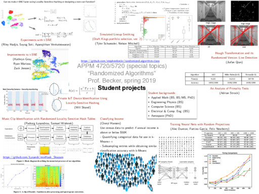

# Randomized Algorithm Class, APPM/STAT 5650, Fall 2021
Randomized algorithm class at CU Boulder, Fall 2021, [Professor Becker](http://amath.colorado.edu/faculty/becker/)

NOTE: Fall 2021, this is APPM/STAT 5650.  These course materials were created Spring 2019 when the same class was taught (also by Stephen Becker) under the special topics designation APPM 4720/5720; an earlier version of the special topics course was taught by Prof. Gunnar Martinsson.

The course meets MWF	10:20 AM - 11:10 AM	ECCR 257 "Newton Lab". The current plan is for the course to meet in person, assuming COVID-19 levels remain reasonable in Boulder.

The actual topics we covered, and links to references, are on this [google sheet](https://docs.google.com/spreadsheets/d/1z2yT99o8nCiotU0OZbrmmk0kAjff5iUDhKo3fpRVORA/edit?usp=sharing).  See below for a high-level list of what we covered. There was no single textbook for the class (and no standard set of notes).

This git repo contains things like code demos used in class. Most of the code is in Matlab; if any students want to translate demos to other languages and then push them, just make a pull request
- [Demos](Demos/)
- [Homeworks](Homeworks/) (homework solutions and code are on the private Canvas website)
- [Syllabus](syllabus.md), which replaces the [OLD Class policies, etc., for Spring 2019](APPM4720_5720_Spr2019_Syllabus.pdf)
  - The syllabus has details on class policies, grading, textbooks and resources, topics covered, etc.

Other material (grades, HW solutions) are in our LMS [Canvas](https://canvas.colorado.edu/courses/76997)

# Student projects
- Spring 2019. Here is a [PDF showing a brief summary of the end-of-semester student projects from Spring '19](SlideshowAllPresentations_4720Spr19_Randomized.pdf).  If you're interested in the Shazam-like song matching algorithm (using locality sensitive hashing), their code is at [Padraig's github site](https://github.com/Lysandr/minHash_Shazam)

